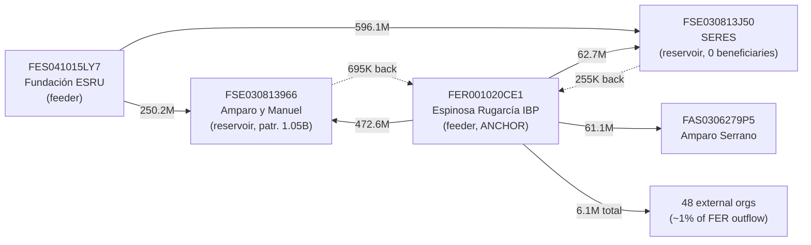

# Suspicious-Relations Report — `FER001020CE1` and its donation network

**Subject:** `FER001020CE1` — *FUNDACIÓN ESPINOSA RUGARCÍA IBP*
**Analyst tool:** `analyze.py graph` (cycle / reciprocal / conduit / cluster / predecessor views)
**Data:** `foundations_full.csv` + cached donation graph `foundations_full_graph.json` (fiscal year 2024, filed 2025; *Donatarias* public-transparency disclosures)
**Date:** 2026-06-01

> ⚠️ **Read this first.** This is a **screening report**, not an audit, accusation, or finding of wrongdoing. Per the project README, this tool is *not* an auditor and *not* a money-laundering detector — it surfaces graph-structural patterns for a human analyst to review. Every pattern below has **common, fully legitimate explanations** (see *Caveats*). The entities and individuals named here are drawn from a public transparency dataset; nothing in this document establishes any impropriety, only patterns worth a closer look.

---

## TL;DR

`FER001020CE1` sits inside a **closed, family-controlled cluster** of foundations that move money among themselves. The tool flagged it because it forms a **strongly-connected cycle** with two sibling foundations while receiving almost nothing back. Tracing one hop further out reveals a consistent **feeder → reservoir** structure across **five entities sharing the same three family board members**, together controlling **~3.7 billion MXN** in patrimonio.

- `FER001020CE1` takes in **950,000** but pays out **602,528,249** — a near-pure **outflow node** (conduit ratio `0.00`).
- **~89%** of that outflow goes to just **two sibling foundations** that share its board; **~99%** stays inside the family network. Only **~1%** reaches 48 unrelated organizations.
- The two recipient siblings are **reservoirs**: they receive ~720M and ~659M and pass on **almost nothing** (retention 95–99.9%).
- A second feeder, `FES041015LY7` (*Fundación ESRU*), pushes **~845M** into the same two reservoirs.

---

## Why `FER001020CE1` was selected

Running the whole-graph `--clusters` scan surfaced a size-3 strongly-connected component with unusually high internal money retention:

```
$ uv run python analyze.py graph --input-file foundations_full.csv --clusters
  1.  size:3   internal:536,250,284   retention:85%   [FER001020CE1, FSE030813966, FSE030813J50]
```

A 3-node closed loop retaining **85%** of half a billion pesos internally is exactly the topology that motivated the new detection features, so `FER001020CE1` (the cycle's anchor) was chosen for a deep dive.

---

## The network at a glance

All five entities share board members from the **same family** — Amparo Espinosa Rugarcía and her sons Manuel & Julio Serrano Espinosa (plus two next-generation members at `FAS`):

| RFC | Name | Role | Income (don.) | Given (don.) | **Patrimonio** | Beneficiaries | Staff | Board (family) |
|---|---|---|---:|---:|---:|---:|---:|---|
| `FES041015LY7` | Fundación **ESRU** AC | **Feeder** | 0 | **903,050,354** | 895,049,923 | 0 | 1 | Amparo·Manuel·Julio |
| `FER001020CE1` | Fundación **Espinosa Rugarcía** IBP | **Feeder** | 950,000 | 564,986,265 | 868,393,816 | 4,001,087 | 68 | Amparo·Manuel·Julio |
| `FSE030813966` | Fundación **Amparo y Manuel** AC | **Reservoir** | 686,751,450 | 719,000 | **1,054,458,705** | 74,090 | 21 | Manuel·Amparo |
| `FSE030813J50` | Fundación **SERES** AC | **Reservoir** | 656,526,204 | 31,204,296 | 829,292,248 | **0** | **1** | Amparo·Julio |
| `FAS0306279P5` | Fundación **Amparo Serrano** AC | Recipient | 73,828,828 | 1,779,427 | 60,439,696 | 743 | 27 | Amparo·Julio·Manuel + 2 |

**Combined patrimonio ≈ 3.71 billion MXN**, controlled by the same three signatories.

RFC structure (3 letters + `YYMMDD` constitution date + homoclave) indicates `FSE030813966` and `FSE030813J50` were **both constituted on 2003-08-13** — sibling registrations differing only in homoclave.

---

## Money flow



Solid arrows = large funding flows; dotted arrows = the **token return** payments that close the loop and create the strongly-connected cycle.

---

## Red-flag patterns (each mapped to the command that surfaced it)

### 1. Asymmetric circular flow — `--rfc … ` (cycles) and `--reciprocal`

```
$ uv run python analyze.py graph --input-file foundations_full.csv --rfc FER001020CE1
  1.  [min:695,000 total:473,308,013 hops:2]  FER001020CE1 -[ef:437,358,700 esp:35,254,313]-> FSE030813966 -[ef:695,000 esp:0]-> FER001020CE1
  2.  [min:255,000 total:62,942,271 hops:2]   FER001020CE1 -[ef:60,399,600 esp:2,287,671]-> FSE030813J50 -[ef:255,000 esp:0]-> FER001020CE1

$ ... --rfc FER001020CE1 --reciprocal
  1.  FER001020CE1 <-> FSE030813966   FER->FSE:472,613,013   FSE->FER:695,000   balance:0.00
  2.  FSE030813J50 <-> FER001020CE1   FSE->FER:255,000        FER->FSE:62,687,271 balance:0.00
```

`FER001020CE1` sends **472.6M** to `FSE030813966` and gets **695,000** back (a **0.15%** return); it sends **62.7M** to `FSE030813J50` and gets **255,000** back (**0.41%**). The `balance:0.00` ratio means these are *not* genuine two-way exchanges — the tiny return is just enough to make the pair (and the cluster) strongly connected. **The money-weighted `bottleneck` metric is what makes this legible:** the "473M cycle" actually circulates only **695K** end-to-end.

### 2. Pure feeder / pure reservoir profiles — `--conduits`

```
FER001020CE1   in:950,000      out:602,528,249   retained:-601,578,249  ratio:0.00   (feeder)
FSE030813966   in:722,848,404  out:719,000       retained: 722,129,404  ratio:0.00   (reservoir)
FSE030813J50   in:658,813,875  out:31,204,296    retained: 627,609,579  ratio:0.05   (reservoir)
```

`FER` is a near-pure **disburser** (out/in ≈ 634×). The two recipients are near-pure **accumulators**: `FSE030813966` keeps **99.9%** of everything it receives; `FSE030813J50` keeps **95.3%**. Money flows *in* and stops.

### 3. Closed related-party cluster — `--clusters`

The size-3 SCC retains **85%** of its money internally. Crucially, the cluster view shows only the **strongly-connected core**; expanding by one hop (see below) reveals the true 5-entity network — the feeder `FES041015LY7` and recipient `FAS0306279P5` are not in the SCC only because they don't receive a token payment back.

### 4. Concentration of outflow — predecessor/successor tracing

```
$ ... --rfc FER001020CE1 --predecessors      # who funds FER
  FSE030813966  ef:695,000      # only the two siblings — i.e. FER is funded by its own grantees' token returns
  FSE030813J50  ef:255,000

# FER's 51 recipients (out-edges), top of list:
  FSE030813966  472,613,013  (78.4%)
  FSE030813J50   62,687,271  (10.4%)
  FAS0306279P5   61,128,828  (10.1%)   <- 3 family entities = 98.9%
  ...48 external orgs sharing the remaining ~1.1%...
```

`FER001020CE1` directs **98.9% of 602M** to three commonly-controlled foundations and spreads the remaining **1.1%** across 48 unrelated organizations.

```
$ ... --rfc FSE030813J50 --predecessors
  FES041015LY7  ef:596,126,604   <- 90% of this reservoir's inflow comes from the ESRU feeder
  FER001020CE1  ef:60,399,600

$ ... --rfc FSE030813966 --predecessors
  FER001020CE1  ef:437,358,700
  FES041015LY7  ef:249,392,750
```

The second feeder, **`FES041015LY7` (Fundación ESRU)** — itself reporting **0 income, 0 beneficiaries, 1 employee** — pushes **~845M** into the same two reservoirs.

### 5. Disclosure anomalies (from `foundations_full.csv`)

- `FSE030813J50`: **656M income, 0 reported beneficiaries, 1 employee** — large sums received, no direct program activity reported.
- `FES041015LY7`: **903M disbursed, 0 beneficiaries, 1 employee** — a pure grant-making shell by headcount.
- `FER001020CE1`: claims **4,001,087 beneficiaries** — an implausibly precise/large figure relative to 950K of donation income; likely an aggregate of indirect beneficiaries that merits verification.

---

## Reproduce

```bash
# 1. Whole-graph cluster scan that first surfaced the group
uv run python analyze.py graph --input-file foundations_full.csv --clusters

# 2. Deep dive on the anchor
uv run python analyze.py graph --input-file foundations_full.csv --rfc FER001020CE1
uv run python analyze.py graph --input-file foundations_full.csv --rfc FER001020CE1 --reciprocal
uv run python analyze.py graph --input-file foundations_full.csv --rfc FER001020CE1 --conduits
uv run python analyze.py graph --input-file foundations_full.csv --rfc FER001020CE1 --predecessors

# 3. Expand the network through the recipients
uv run python analyze.py graph --input-file foundations_full.csv --rfc FER001020CE1 --successors
uv run python analyze.py graph --input-file foundations_full.csv --rfc FSE030813966 --predecessors
uv run python analyze.py graph --input-file foundations_full.csv --rfc FSE030813J50 --predecessors
```

---

## Caveats & legitimate explanations

This structure is **consistent with a perfectly lawful family philanthropic architecture**, and that is arguably the *most likely* explanation:

- **Grant-making + operating split is standard.** A family endowment or grant-making foundation funding affiliated operating foundations is a normal, legal structure worldwide. "0 beneficiaries / 1 employee" is typical of an **endowment/grant-making vehicle** that doesn't run programs itself.
- **High patrimonio retention is the *point* of an endowment** — capital is preserved and grants are made from returns, not principal. `FER001020CE1` is an *IBP* (Institución de Beneficencia Privada), a regulated charitable form.
- **Token "return" donations** (695K, 255K) that create the cycles may be cost reimbursements, shared-service allocations, or ordinary small grants — not evidence of round-tripping.
- **Related boards are disclosed**, not hidden — this data comes from the entities' own public transparency filings.
- The graph reflects a **scraped subset** of the full dataset and a **single fiscal year**; flows to/from entities outside the subset are invisible here.

**None of the above is evidence of money laundering, fraud, or any illegality.** The findings show *related-party concentration*, which is a screening signal, not a conclusion.

## Suggested next steps for an analyst

1. Pull the multi-year history for the five RFCs to see whether the feeder→reservoir pattern is structural or one-off.
2. Verify `FER001020CE1`'s 4,001,087-beneficiary figure against its program disclosures.
3. Examine what the reservoirs (`FSE030813966`, `FSE030813J50`) ultimately do with the ~1.4B they accumulated — grants, investments, or program spend.
4. Cross-check the boards against any **for-profit** entities the same individuals control (outside this dataset's scope).
5. ~~Tool improvement: a `--successors` view would let an analyst expand the network outward without a manual graph query.~~ **Added** — the recipient breakdown above is now reproducible via `--rfc FER001020CE1 --successors` (sorted by cash amount).

---

*Generated from `analyze.py` graph analysis. Screening aid only — verify against primary sources before drawing any conclusion.*
